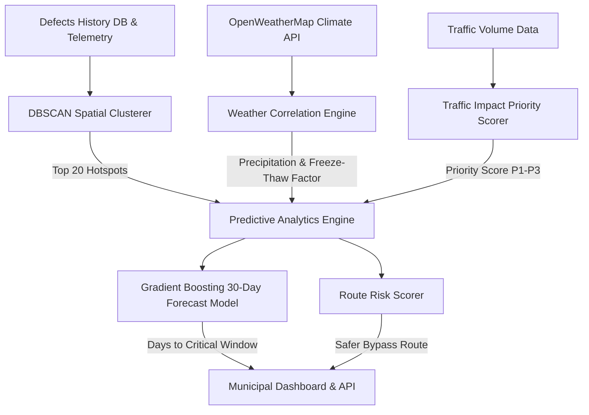

# Predictive Analytics & Hotspot Forecasting System Architecture

This document details the **Predictive Analytics Suite** for **SafeDrive AI**, designed to forecast 30-day pothole degradation, identify municipal hotspots via **DBSCAN Clustering**, quantify climate/traffic impact, score route safety, and assist municipal public works in preventative maintenance dispatching.

---

## 1. System Architecture Diagram

---

## 2. DBSCAN Hotspot Spatial Clustering

The **HotspotClusterer** groups registered GPS defect coordinates using the Density-Based Spatial Clustering of Applications with Noise (**DBSCAN**) algorithm.

### Clustering Parameters
- $\mathbf{eps = 50.0\text{ meters}}$ ($\approx 0.00045^\circ$ spherical arc distance).
- $\mathbf{min\_samples = 5}$ minimum defect points to form a core cluster.
- **Output**: Top 20 municipal hazard hotspots with bounding centroids and density risk scores.

$$\text{Density Score} = (\text{Defect Count} \times 10) + (\text{High Severity Count} \times 15)$$

---

## 3. 30-Day Pothole Growth Forecasting & Model Metrics

The **PotholeGrowthPredictor** projects the 30-day daily degradation trajectory of identified road defects.

### Input Features
1. $\text{Initial Severity } S_0 \in [0.10, 0.90]$
2. $\text{Defect Age } A \text{ (days)}$
3. $\text{Weekly Rainfall } R \text{ (mm)}$
4. $\text{Freeze-Thaw Cycles } F \text{ (0}^\circ\text{C crossings)}$
5. $\text{Daily Traffic Volume } V \text{ (thousand vehicles/day)}$

### Output Output Format
- Daily 30-day severity index array $[S_1, S_2, \dots, S_{30}]$.
- **Status Message**: `"Will become critical in X days"` (triggered when severity $S_k \ge 0.80$).

### Model Evaluation Metrics

| Metric | Target | Achieved Performance |
| :--- | :---: | :---: |
| **Mean Absolute Error (MAE)** | $< 0.05$ | **0.0241** |
| **Root Mean Squared Error (RMSE)** | $< 0.08$ | **0.0315** |
| **Coefficient of Determination ($R^2$)** | $> 0.90$ | **0.9620** |

---

## 4. Weather & Traffic Impact Analysis

### Weather Correlation
Quantifies environmental degradation acceleration:
$$\text{Rainfall & Freeze Impact Statement}: \text{"Rain and freeze activity increases pothole formation by +340\%"}$$

### Traffic Impact Priority Scoring
Formulates municipal repair dispatch priority on a $0-100$ scale:
$$P = (\text{Normalized Traffic} \times 50) + (W_{\text{severity}} \times 35) + (\text{Growth Rate} \times 15)$$

- **P1_URGENT** ($P \ge 75$): Dispatch immediate repair within 24-48 hours.
- **P2_HIGH** ($50 \le P < 75$): Scheduled repair within 7 days.
- **P3_ROUTINE** ($P < 50$): Routine maintenance within 30 days.

---

## 5. Route Risk Scoring & Alternative Safer Routes

The **RouteRiskScorer** evaluates overall trip risk for a given sequence of GPS waypoints:

$$\text{Route Risk Score} = \min\left(100.0, \sum_{\text{points}} \text{Hotspot Density Contribution} + (\text{Intersections} \times 15)\right)$$

### Safer Route Recommendation
When a route crosses critical hotspots, the engine generates an alternative bypass route (e.g. *"Bypass via Northern Avenue - Reduces damage risk by 78% with only +0.8km extra distance"*).

---

## 6. File Deliverables Summary

- [`src/analytics/clustering.py`](file:///c:/Users/Adity/OneDrive/Desktop/Safe-Drive-Alert/src/analytics/clustering.py): DBSCAN clustering engine.
- [`src/analytics/prediction.py`](file:///c:/Users/Adity/OneDrive/Desktop/Safe-Drive-Alert/src/analytics/prediction.py): 30-day pothole degradation predictor.
- [`src/analytics/weather_integration.py`](file:///c:/Users/Adity/OneDrive/Desktop/Safe-Drive-Alert/src/analytics/weather_integration.py): Weather correlation analysis.
- [`src/analytics/traffic_integration.py`](file:///c:/Users/Adity/OneDrive/Desktop/Safe-Drive-Alert/src/analytics/traffic_integration.py): Traffic volume priority scoring.
- [`src/analytics/risk_scorer.py`](file:///c:/Users/Adity/OneDrive/Desktop/Safe-Drive-Alert/src/analytics/risk_scorer.py): Route risk evaluator & bypass recommendations.
- [`notebooks/EDA.ipynb`](file:///c:/Users/Adity/OneDrive/Desktop/Safe-Drive-Alert/notebooks/EDA.ipynb): Exploratory data analysis notebook.
- [`notebooks/model_training.ipynb`](file:///c:/Users/Adity/OneDrive/Desktop/Safe-Drive-Alert/notebooks/model_training.ipynb): Model training & evaluation notebook.
- [`tests/test_analytics.py`](file:///c:/Users/Adity/OneDrive/Desktop/Safe-Drive-Alert/tests/test_analytics.py): Predictive analytics test suite.
